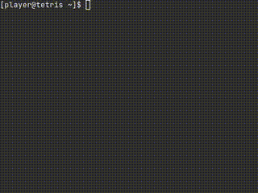

# Tetris Game in C++ using ncurses

A simple implementation of the classic Tetris game written in C++ using the `ncurses` library for terminal-based graphical display.



## Steps to Install

```
git clone https://github.com/jenutz/tetris
cd tetris
make
```

